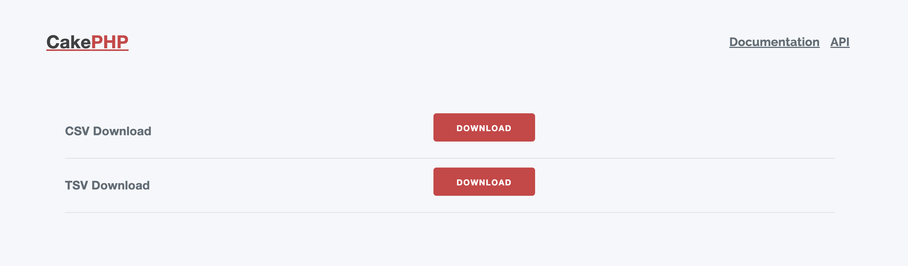

# CakePHP4 CSV/TSV Download Demo

This is a sample app to implement CSV/TSV download feature with CakePHP4. (it can be implemented in the same way in CakePHP3 as well)

- [CakePHP4](https://cakephp.org/)
- [sathi/csv-combine](https://github.com/satthi/csv-combine)

More detailed is here:
WIP

[See Implemetations](https://github.com/NaoyaMiyagawa/cakephp4-csv-download-demo/compare/5cc67326f620791cbaab7eca61a25a5ffbf09044...7886cc21c8374badf11de2df74446bec77299149)

## How to Get Started

```bash
cp .env.example .env; vim .env

# Run CakePHP build-in webserver
docker compose up -d

# Install php dependencies
docker compose exec web composer install
```

Visit http://localhost/pages/demo



## Sample Files
Can be found here `./sample_files`
